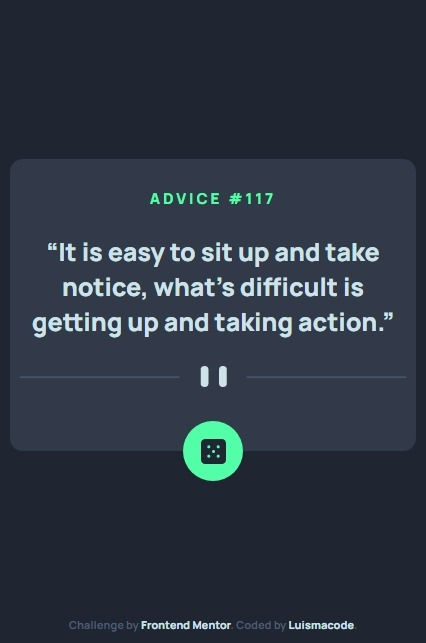
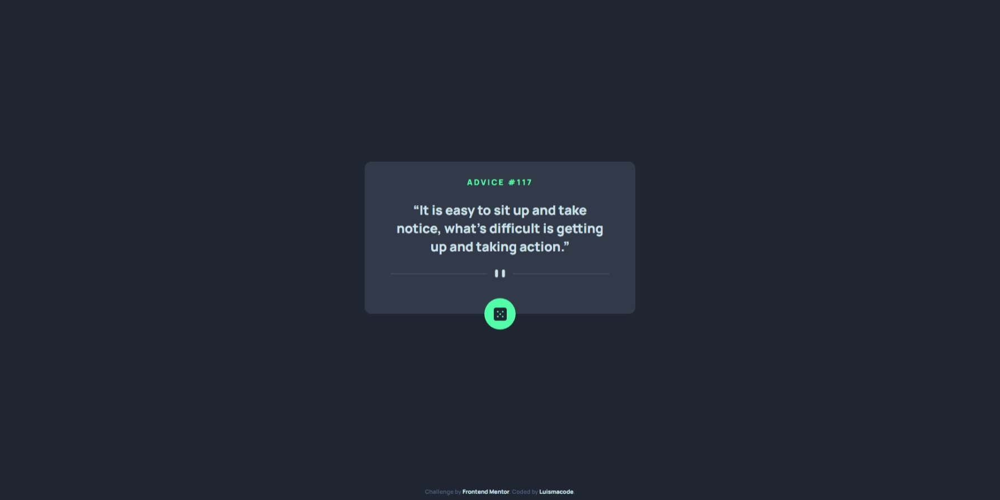

# Frontend Mentor - Advice generator app solution

This is a solution to the [Advice generator app challenge on Frontend Mentor](https://www.frontendmentor.io/challenges/advice-generator-app-QdUG-13db). Frontend Mentor challenges help you improve your coding skills by building realistic projects.

## Table of contents

- [Overview](#overview)
  - [Screenshot](#screenshot)
  - [Links](#links)
- [My process](#my-process)
  - [Built with](#built-with)
  - [What I learned](#what-i-learned)
  - [Continued development](#continued-development)
  - [Useful resources](#useful-resources)
- [Author](#author)
- [Acknowledgments](#acknowledgments)

## Overview

### Screenshot




### Links

- Solution URL: [solution](https://www.frontendmentor.io/solutions/advicegeneratorapp-p9jJHy3RC)
- Live Site URL: [live demo](https://luismacode.github.io/advice-generator-app-main/)

## My process

### Built with

- Semantic HTML5 markup
- CSS custom properties
- Javascript
- Mobile-first workflow
- BEM

### What I learned

1.Fetching a json file using an async function

  ```js
  async ()=>{
    // returns a response object
    const response = await fetch("https://api.adviceslip.com/advice")
    //extract the content of the JSON body of the response object
    const json =  await response.json()
    console.log(json)
  }
  ```

2. Handle errors with try and catch

  ```js
  try {
    if (response.ok) {
      // render the advice if Http response code is successful
    }
  } catch (error) {
    //this is applied when an error occurs
  }
  ```

### Continued development

### Useful resources

- [Using-fetch](https://developer.mozilla.org/en-US/docs/Web/API/Fetch_API/Using_Fetch)
- [error-handling](https://web.dev/fetch-api-error-handling/)

## Author

- Linkedin - [luismachaca](www.linkedin.com/in/luismachaca)
- Frontend Mentor - [@luismacode](https://www.frontendmentor.io/profile/luismacode)
- Twitter - [@luismacode](https://www.twitter.com/luismacode)
